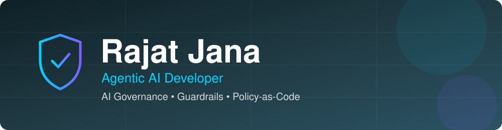

<div align="center">



**Building guardrails for autonomous AI agents · Policy-as-code for AI & ICT governance · Making AI safe, compliant and auditable**


[](https://github.com/RajatJana?tab=followers)

</div>

---

## 👨‍💻 About Me

Hi, I'm **Rajat** 👋, an **Agentic AI developer** from **Kolkata, India**, working in AI tech.

As AI agents start calling tools, moving money and handling sensitive data, one question matters most: **how do you keep them safe, compliant and accountable?**

That's what I build. My work focuses on **AI governance and guardrail infrastructure**:

- 🛡️ Real-time **guardrails** that sit between AI agents and the real world
- 📜 **Policy-as-code** engines where compliance rules live in simple YAML
- 🔍 **Audit trails** and reporting for regulated industries (banking, fintech, ICT)
- 🤖 **LLM-as-Judge** checks across OpenAI, Anthropic and Google Gemini

---

## 🚀 Featured Projects

### 🛡️ [Guardrail Engine SDK](https://github.com/RajatJana/GuardrailEngine)

> A high-performance, real-time **guardrail and policy enforcement SDK** for **banking, fintech and AI-assisted financial operations**.

- **Channel-aware routing** across `PAYMENT`, `LOAN`, `KYC` and `CHAT` pipelines
- **Dual enforcement modes**: a passive *Observer* PEP for audits and a fail-closed *Enforcer* PEP that blocks violations
- **Built-in checks** for AML velocity, sanctions and blocklists, FATF country risk, LTI/LTV/DTI ratios and KYC completeness
- **Real-time PII redaction** (card numbers, SSNs) in LLM assistant responses
- **Declarative YAML rules** with hot-reload, plus in-memory rules for dynamic use
- Structured **JSONL compliance audit logs**

`Python` `asyncio` `YAML` `watchdog` `PEP architecture` `Fintech`

```bash
pip install git+https://github.com/RajatJana/GuardrailEngine.git
```

---

### 🏛️ [Governance Engine SDK](https://github.com/RajatJana/GovernanceEngine)

> An **AI & ICT governance policy engine**. Define, evaluate and enforce compliance policies against AI output, tool calls and security reports.

- **Policies as YAML**: threshold, regex, keyword, allowlist, blocklist and **LLM-judge** checks
- **Evaluates 4 stages** of an AI pipeline: `input`, `prompt`, `output`, `tool_call`
- **Vulnerability report compliance** for HTML, PDF, JSON, Excel, DOCX, XML, CSV and SARIF, checked in one call
- **Multi-provider LLM-as-Judge** with OpenAI, Anthropic Claude and Google Gemini
- **Hot-reload** of policies and loading from **Git policy sources**
- Observer (log-only) and Enforcer (inline blocking) modes with JSON reporting

`Python` `YAML` `LLM-as-Judge` `OpenAI` `Anthropic` `Gemini` `DORA compliance`

```bash
pip install git+https://github.com/RajatJana/GovernanceEngine.git
```

---

> 🔥 **More agentic AI projects coming soon.**

---

## 🛠️ Tech Stack


**Focus areas:** AI Agents · AI Governance · Guardrails · Policy-as-Code · LLM-as-Judge · Compliance Automation · Audit Logging

---

## 📊 GitHub Stats

<div align="center">


</div>

---

## 🤝 Let's Connect

Interested in AI safety, agent guardrails or governance tooling? Let's talk.

<div align="center">

[](https://linkedin.com/in/YOUR-LINKEDIN)
[](mailto:YOUR-EMAIL@example.com)

</div>

---

<div align="center">

💡 *"Powerful agents need strong guardrails."*


</div>
